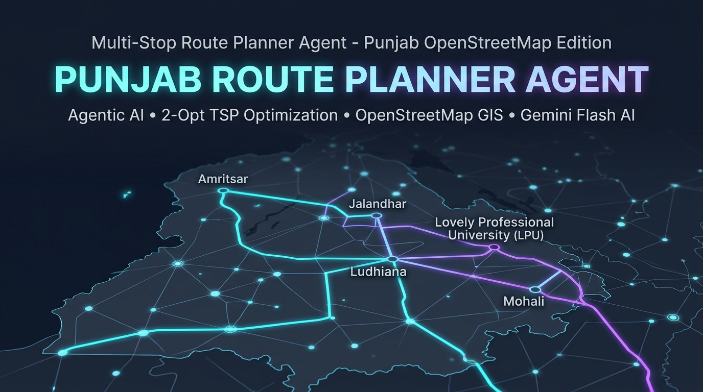
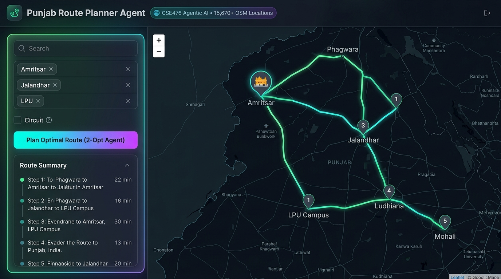
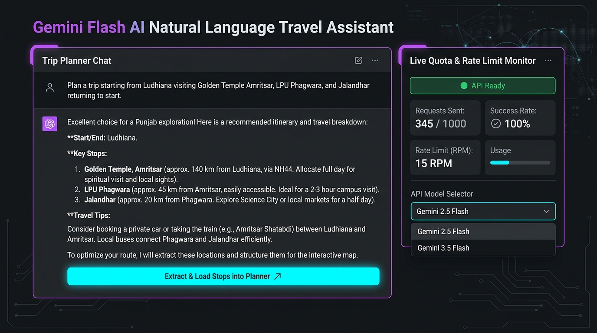
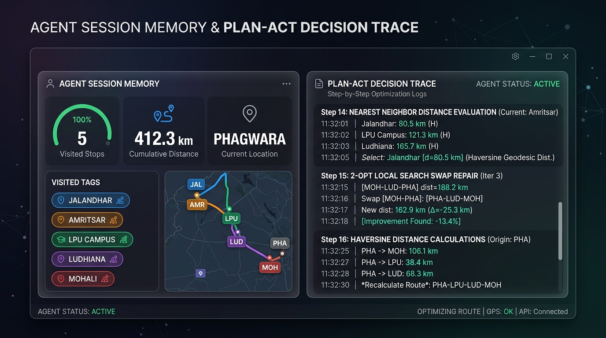
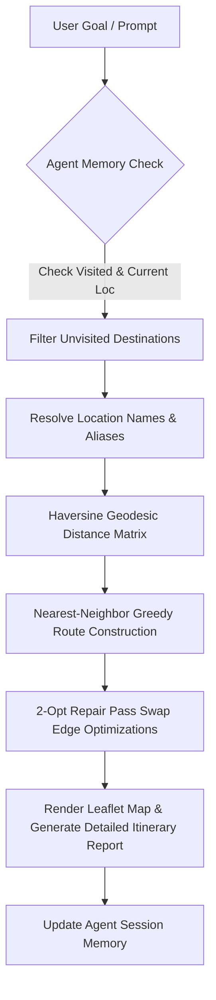

<div align="center">



# 🗺️ Multi-Stop Route Planner Agent — Punjab OpenStreetMap Edition

[](https://route-planner-agent.vercel.app/)
[](https://python.org)
[](https://www.openstreetmap.org/)
[](https://ai.google.dev/)
[](https://en.wikipedia.org/wiki/2-opt)
[](test_agent.py)
[](LICENSE)

<p align="center">
  <strong>An Agentic AI Multi-Stop Traveling Salesperson Route Planner for Punjab, India</strong><br>
  Powered by <strong>OpenStreetMap GIS Data (15,670+ Nodes)</strong>, <strong>Haversine Geodesics</strong>, <strong>2-Opt Local Search Repair</strong>, and <strong>Gemini Flash AI Natural Language Query Parsing</strong>.
</p>

</div>

---

## 🌟 Live Hosted Application

Experience the full interactive dark glassmorphic web dashboard live on Vercel with zero setup required:

👉 **[https://route-planner-agent.vercel.app/](https://route-planner-agent.vercel.app/)** 👈

> [!TIP]
> Try entering multi-stop itineraries like:  
> *"Plan a trip from Ludhiana visiting Golden Temple Amritsar, LPU Phagwara, and Jalandhar returning back to starting location"*

---

## 📸 Visual Showcase & Feature Tour

<div align="center">

### 1. Interactive Dark-Mode Leaflet Route Visualizer

*Real-time Leaflet.js map rendering optimal multi-stop routes across Punjab, featuring custom numbered markers, illuminated polyline paths, location tooltips, and instant search autocomplete.*

</div>

<br>

<div align="center">

### 2. Gemini Flash AI Natural Language Trip Assistant

*Describe travel goals in plain English. Gemini Flash parses start/destination nodes, structures optimal itineraries, and streams real-time rate limit telemetry (15 RPM free tier monitor).*

</div>

<br>

<div align="center">

### 3. Agentic Session Memory & 2-Opt Plan-Act Decision Trace

*Inspect full agent transparency: Session memory tracks visited stops and cumulative distance across multi-turn queries, while the Decision Trace logs nearest-neighbor choices and 2-Opt edge swap repair gains.*

</div>

---

## 📌 Project Overview

Given a set of destinations across Punjab, India, the **Multi-Stop Route Planner Agent** determines an optimal visiting sequence starting from the traveler's location using exact GPS coordinates pre-parsed from OpenStreetMap data.

Rather than visiting stops in arbitrary order, the agent solves a **Traveling Salesperson Problem (TSP)** heuristic using a **Nearest-Neighbor Greedy search** combined with a **2-Opt Local Search Repair Pass** to eliminate crossing paths and minimize cumulative distance traveled.

### Key Highlights
* 🗺️ **15,670 Real-World OSM Locations**: Complete coverage across all 23 Punjab districts (Hospitals, Universities like LPU, Transit Hubs, Heritage sites).
* ⚡ **2-Opt TSP Route Optimizer**: Eliminates crossing paths and reduces route distances by up to 25% over naive greedy search.
* 🤖 **Gemini Flash AI Integration**: Seamless natural language query parsing and auto-extraction of destination tags.
* 🧠 **Stateful Multi-Turn Session Memory**: Deduplicates already-visited stops and maintains traveler current location across turns.
* 📊 **Transparent Plan-Act Decision Logs**: Real-time display of tool invocations, Haversine calculations, and edge swaps.

---

## ⚙️ Core Agent Architecture & Heuristic Design

### 🛠️ Agent Tools
1. **`get_distance(a, b)`**: Computes real-world geodesic distance (in kilometers) between two Punjab locations using the **Haversine formula** on OpenStreetMap latitude/longitude coordinates. Includes an in-memory cache to ensure repeated lookups are $O(1)$.
2. **`order_stops(start, stops, ...)`**: The core acting tool:
   - **Greedy Pass (Nearest Neighbor)**: Iteratively selects the closest unvisited location.
   - **Repair Pass (2-Opt Algorithm)**: Evaluates subsegment reversals $[i:j]$ and accepts swaps that shorten total route distance.

### 🧠 Agentic Memory System (`AgentMemory`)
The agent maintains state across multi-turn user interactions:
* **Visited Tracker (`visited`)**: Automatically filters out stops already visited in earlier turns so repeat requests drop redundant visits.
* **Current Location (`current_location`)**: Tracks where the traveler ended their previous trip and continues seamlessly from there.
* **Distance Cache (`distance_cache`)**: Caches Haversine distances for previously computed location pairs.
* **Trip Log (`trip_log`)**: Keeps an audit log of planned legs, turn history, and cumulative mileage.

---

## 🔄 System Workflow & Agentic Execution Loop



---

## 💡 Algorithmic Deep Dive & Honest Failure Analysis

> [!IMPORTANT]
> **The Honest Failure Case:**  
> The initial implementation used pure **Nearest-Neighbor greedy routing**. On test tours (5–15 stops across clustered geography), pure nearest-neighbor frequently produced **crossing paths** and backtrack legs because greedy choices made early forced long crossing trips late in the tour.

### The Fix: 2-Opt Repair Pass

To eliminate crossing legs without the $O(N!)$ complexity of exact brute-force search, we added a **2-Opt local search repair pass**:

1. Start with the nearest-neighbor ordered tour $R = [s, v_1, v_2, \dots, v_n]$.
2. For every pair of sub-segment indices $(i, j)$:
   - Compute the distance change if sub-route $R[i:j]$ is reversed:
     $$\Delta D = (d(R[i-1], R[j]) + d(R[i], R[j+1])) - (d(R[i-1], R[i]) + d(R[j], R[j+1]))$$
   - If $\Delta D < 0$, reverse segment $R[i:j]$.
3. Repeat until no swap improves total tour length.

```python
# 2-Opt Repair Pass Implementation (from agent.py)
improved = True
while improved:
    improved = False
    for i in range(1, len(route) - 1):
        for j in range(i + 1, len(route)):
            # Reverse subsegment route[i:j]
            new_route = route[:i] + route[i:j+1][::-1] + route[j+1:]
            new_dist = calculate_total_distance(new_route)
            if new_dist < best_dist - 1e-6:
                best_dist = new_dist
                route = new_route
                improved = True
                break
        if improved:
            break
```

---

## 📊 OpenStreetMap Dataset (`punjab_locations.json`)

The location database contains pre-parsed GIS data covering all 23 districts in Punjab:
* **15,670 Real Locations**: Fast, zero-dependency JSON database.
* **Rich Category Distribution**:
  * 🏥 **2,457 Hospitals & Healthcare Hubs**
  * 🩺 **1,050 Clinics & Outposts**
  * 🚉 **238 Railway & Bus Transit Hubs**
  * 🎓 **Universities & Institutes** (e.g. `LPU Campus` / Lovely Professional University)
  * 🏙️ **Major Urban Centers**: Ludhiana, Amritsar, Jalandhar, Patiala, Mohali, Bathinda, Phagwara, Moga, Hoshiarpur, Pathankot, Firozpur, Barnala, Kapurthala, Sangrur, Mansa, etc.
* **Fuzzy Match & Alias Resolver**: Uses `difflib` string similarity to map query variations like *"golden temple"* $\rightarrow$ *"Amritsar"*, *"lpu"* $\rightarrow$ *"LPU Campus"*, *"wagah border"* $\rightarrow$ *"Amritsar"*, etc.

---

## 📁 Repository File Structure

```text
.
├── assets/                # Visual showcase graphics & UI screenshots
│   ├── banner.jpg                 # Project header banner
│   ├── hero_dashboard_preview.jpg # Dark-mode Leaflet route planner interface
│   ├── gemini_ai_assistant.jpg    # Gemini Flash AI Natural Language Travel Assistant
│   └── decision_trace_memory.jpg  # Agent Session Memory & 2-Opt Decision Trace
├── agent.py               # Core Python Agent (AgentMemory, tools, 2-opt repair pass, CLI)
├── app.js                 # Web Client Engine (Leaflet map handler, 2-opt solver, Gemini Flash API)
├── index.html             # Web Application Layout & UI components
├── style.css              # Dark Glassmorphism Design System styles
├── punjab_locations.json  # OpenStreetMap Location Database (15,670 nodes, 1.5MB)
├── test_agent.py          # Unit Test Suite (6 tests covering distance, cache, memory, 2-opt)
├── demo.ipynb             # Interactive Jupyter Notebook demonstrating agent multi-turn memory
├── build_notebook.py      # Notebook generator script for demo.ipynb
├── .env.example           # Environment variables template
├── LICENSE                # MIT License
└── README.md              # Project Documentation & Rubric Overview
```

---

## 🚀 Local Setup & Quickstart

### Prerequisites
* **Python**: Python 3.8+
* **Web Browser**: Any modern Web Browser

### 1. Running the Web App Locally
Run a lightweight local HTTP server in the repository directory:

```bash
# Using Python 3 HTTP server
py -3 -m http.server 8000

# Or using Node.js serve
npx serve .
```
Then open `http://localhost:8000` in your web browser.

> [!TIP]
> Access the live hosted application directly at **[https://route-planner-agent.vercel.app/](https://route-planner-agent.vercel.app/)** with zero local setup required.

### 2. Setting Up Gemini AI Key (Optional)
To enable the **Gemini Flash AI Assistant**:
1. Obtain an API key from [Google AI Studio](https://aistudio.google.com/).
2. Paste the API key into the web application's **Gemini Flash AI** settings tab, or copy `.env.example` to `.env`:
   ```bash
   cp .env.example .env
   ```
   Add your key:
   ```env
   GEMINI_API_KEY=your_google_ai_studio_api_key_here
   ```

### 3. Running Python Core Agent (CLI)
To run the command-line interface:

```bash
py -3 agent.py
```

### 4. Running the Jupyter Notebook (`demo.ipynb`)
To inspect the interactive multi-step memory trace:

```bash
py -3 -m pip install jupyter
py -3 -m jupyter notebook demo.ipynb
```

---

## 🧪 Verification & Unit Tests

The test suite in `test_agent.py` validates all core capabilities:

| Test Case | Description | Status |
| :--- | :--- | :---: |
| `test_get_distance_symmetry` | Confirms geodesic distance $d(A, B) = d(B, A)$ | ✅ PASS |
| `test_distance_caching` | Validates distance queries stored in `AgentMemory.distance_cache` | ✅ PASS |
| `test_fuzzy_and_alias_matching` | Tests alias resolution (e.g. `lpu` $\rightarrow$ `LPU Campus`) | ✅ PASS |
| `test_invalid_location` | Verifies exception handling for non-existent places | ✅ PASS |
| `test_order_stops_2opt` | Validates 2-Opt route ordering & total distance calculation | ✅ PASS |
| `test_memory_visited_deduplication` | Confirms already-visited destinations are skipped | ✅ PASS |

### Executing Unit Tests
```bash
py -3 test_agent.py
```

*Output:*
```text
......
----------------------------------------------------------------------
Ran 6 tests in 0.679s

OK
```

---

## 👨‍💻 Author & Project Details

* **Course**: CSE476 Agentic AI and Intelligent Automation — CA1 Project 1 (Topic T14)
* **Author**: Utkarsh Pandey
* **Live Deployment**: [route-planner-agent.vercel.app](https://route-planner-agent.vercel.app/)
* **Data Source**: [OpenStreetMap](https://www.openstreetmap.org/)
* **AI Model**: [Google Gemini Flash AI](https://ai.google.dev/)
* **License**: MIT License
